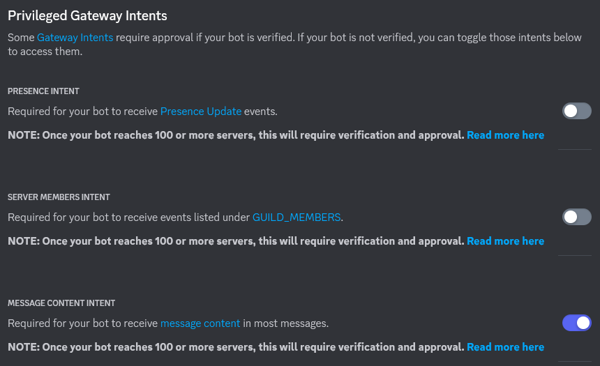
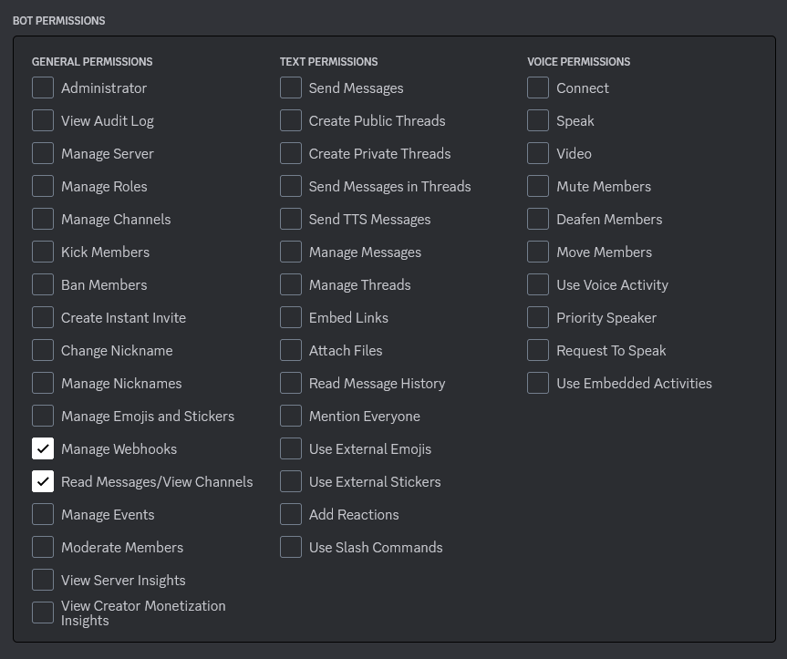

# discord-auto-translator
Discordのチャンネルに送られたメッセージをDeepL翻訳で自動翻訳を行い、対応したチャンネルに送信するbotです。

## 使用方法
### 環境変数について
このbotは環境変数`DISCORD_TOKEN`と`DEEPL_TOKEN`を参照しています。
それぞれDiscordのBOTアカウントのトークンと、DeepL APIのトークンを指定してから実行してください。<br>
(`cargo run`等デバッグモードで実行する場合は`.env`ファイル内の`DISCORD_TOKEN`の代わりに`DEBUG_DISCORD_TOKEN`を参照します。)

### DiscordのBOTアカウントについて
このBOTの稼働には、BOTアカウントのGateway Intentsの`MESSAGE CONTENT INTENT`の承認と、`Manage Webhooks`と`Read Message/View Channels`の権限が必要です。(今後のアップデートでさらに権限が必要になる可能性があります。)



### 翻訳の設定について
このBOTは各チャンネルのトピックを参照して翻訳の設定を行います。翻訳を使用したいチャンネルのトピックに次の形式で設定を記入してください。
```toml
# 設定例
[Auto Translate]
lang=JA # このチャンネルの言語
to=[1075242305721733150, 945661671509229678]    # 翻訳先のチャンネル（複数ある場合は「, 」で分割）
```
言語として使用できるものは次の通りです。詳細は[DeepL APIのドキュメント](https://www.deepl.com/ja/docs-api/translate-text/translate-text/)の`source_lang`の項目を参照してください。
```
BG - ブルガリア語
CS - チェコ語
DA - デンマーク語
DE - ドイツ語
EL - ギリシャ語
EN - 英語
ES - スペイン語
ET - エストニア語
FI - フィンランド語
FR - フランス語
HU - ハンガリー語
ID - インドネシア語
IT - イタリア語
JA - 日本語
KO - 韓国語
LT - リトアニア語
LV - ラトビア語
NB - ノルウェー語
NL - オランダ語
PL - ポーランド語
PT - ポルトガル語
RO - ルーマニア語
RU - ロシア語
SK - スロバキア語
SL - スロベニア語
SV - スウェーデン語
TR - トルコ語
UK - ウクライナ語
ZH - 中国語
```